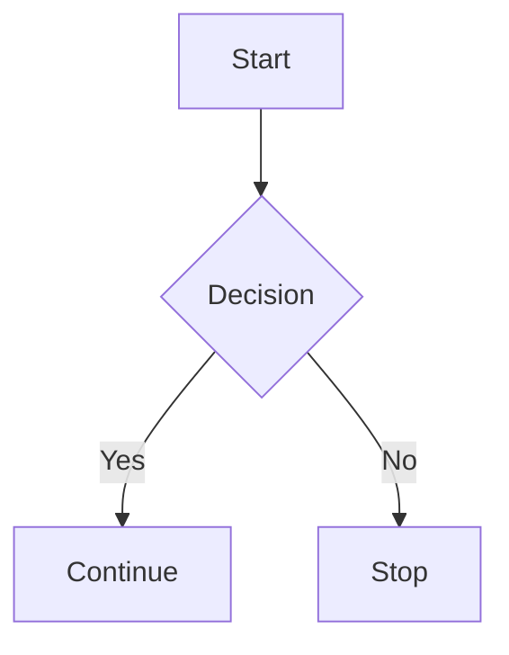

# GFM Smoke Test

This file is opened in CodeView's `.md` Rendered preview to confirm the GFM HTML
+ footnote work renders correctly. It is not a runnable test.

## Inline HTML

Press <kbd>Cmd</kbd>+<kbd>K</kbd> to clear. H2O reacts with E=mc2.
This is <u>important</u>, this is <del>old</del>, and this is <mark>highlighted</mark>.

## Block HTML

Click to see commands

Body text inside details.

<table>
<thead><tr><th>Cmd</th><th>What</th></tr></thead>
<tbody>
<tr><td>build</td><td>Compile the project</td></tr>
<tr><td>test</td><td>Run the test suite</td></tr>
</tbody>
</table>

## Mermaid

## Footnotes

A claim with a footnote.[^why] And another reference to the same one.[^why]
And a separate footnote.[^how]

[^why]: Because the spec says so.
[^how]: With a hand-rolled two-pass parser.

## Stripped

This text appears.

## Existing GFM (regression baseline)

- [ ] Task list works
- [x] So does this one
- ~~strikethrough~~
- A bare URL: https://github.com
- A pipe table:

| Col A | Col B |
|-------|-------|
| 1     | 2     |
