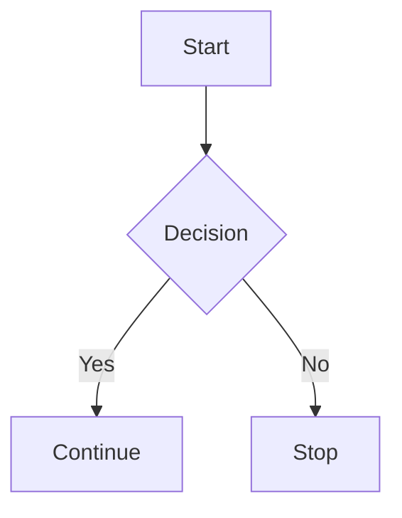

# GFM Markdown Preview — Plan 1: HTML + Footnotes

> **For agentic workers:** REQUIRED SUB-SKILL: Use `superpowers:subagent-driven-development` (recommended) or `superpowers:executing-plans` to implement this plan task-by-task. Steps use checkbox (`- [ ]`) syntax for tracking. Read [`PRODUCT.md`](./PRODUCT.md) and [`TECH.md`](./TECH.md) before starting; this plan assumes both have been read.
>
> **Signing rule:** Every `git commit` in this plan MUST pass `-S`. The repo's local `commit.gpgsign` is false; without `-S` commits land unsigned. After each commit, run `git log -1 --show-signature` and confirm a `Good "git" signature` line. If signing failed, STOP and surface to the user.
>
> **AI attribution rule:** Commit messages and any file added by this plan MUST contain no AI-attribution markers. Do NOT add `Co-Authored-By:` lines naming an AI tool, model, or harness. Do NOT add "Generated with …" footers. Run `./script/check_ai_attribution` before every commit.
>
> **Branch verification rule:** Before each commit run `git branch --show-current`. If the branch is not `cast/md-html-support` (or whatever branch you started this work on), STOP — a parallel call may have switched HEAD.

**Goal:** Render the GFM HTML safe-list and footnotes inside `.md` files when viewed in CodeView's Rendered preview, with no regression to existing markdown rendering or HTML-paste handling.

**Architecture:** All work lives in `crates/markdown_parser/`. Refactor `html_parser.rs` to expose two pub-crate helpers (`parse_html_inline_fragments`, `parse_html_block_lines`) that the existing `parse_html` entry point also uses. Add a new `gfm_html.rs` with the safe-list constants and a hand-rolled HTML-span lexer. Wire the lexer into `parse_markdown_internal` (block context) and `parse_inline_token` (inline context). Add a new `footnotes.rs` with a two-pass extract-and-rewrite implementation called from `parse_markdown_impl`. No editor, renderer, AI-block, or notebook changes.

**Tech Stack:** Rust 2024 edition, `nom` parser combinators (existing), `html5ever` + `markup5ever_rcdom` (existing), `anyhow` (existing). No new dependencies.

---

## Files created or modified

**Created:**

| Path | Responsibility |
|---|---|
| `crates/markdown_parser/src/gfm_html.rs` | Safe-list / stripped-list tag constants; `try_lex_html_span` lexer; `HtmlSpan` type. |
| `crates/markdown_parser/src/gfm_html_tests.rs` | Unit tests for the lexer (open/close pairing, self-closing, attributes, nesting, missing close). |
| `crates/markdown_parser/src/footnotes.rs` | `FootnoteDef` collection, reference rewriting, appended-section construction. |
| `crates/markdown_parser/src/footnotes_tests.rs` | Unit tests for the two-pass footnote pipeline. |
| `crates/markdown_parser/test-fixtures/gfm-smoketest.md` | Manual smoke fixture for CodeView visual verification (not a runnable test). |

**Modified:**

| Path | Change |
|---|---|
| `crates/markdown_parser/src/lib.rs` | Add `mod gfm_html;` and `mod footnotes;` lines. No public API changes. |
| `crates/markdown_parser/src/html_parser.rs` | Refactor: split the existing `parse_html` body into two new `pub(crate)` helpers `parse_html_inline_fragments(html: &str) -> Vec<FormattedTextFragment>` and `parse_html_block_lines(html: &str) -> Vec<FormattedTextLine>`. `parse_html` becomes a thin wrapper. Extend the per-element match to handle `details`, `summary`, `kbd`, `sub`, `sup`, `del`, `mark`, raw `<table>`, raw ``. |
| `crates/markdown_parser/src/markdown_parser.rs` | Add a block-level HTML branch in `parse_markdown_internal`'s `alt` chain. Add an inline-level HTML branch in `parse_inline_token`. Wrap the existing `parse_markdown_impl` call with the footnote pipeline. |
| `crates/markdown_parser/src/markdown_parser_tests.rs` | Add the new HTML + footnote test cases (listed in TECH §6). |
| `crates/markdown_parser/src/html_parser_tests.rs` | Add cases that confirm the refactor's existing-paste behavior is unchanged. |
| `DESIGN-CHANGES.md` | Append a short entry noting GFM HTML + footnote support in the `.md` preview. |

---

## Phase 0 — Branch / environment checks

### Task 0.1: Confirm working environment

**Files:** none.

- [ ] **Step 1: Confirm branch and clean working tree (besides expected auth files)**

Run:
```bash
git branch --show-current
git status
```
Expected: branch `cast/md-html-support`; only `app/src/auth/auth_manager.rs` and `app/src/auth/auth_state.rs` show as modified (pre-existing changes from prior session — leave them alone).

- [ ] **Step 2: Confirm signing key is set**

Run:
```bash
git config --get user.signingkey
git config --get gpg.format
```
Expected: both return non-empty values. If either is empty, STOP and tell the user signing is misconfigured.

- [ ] **Step 3: Confirm AI-attribution guard is executable**

Run:
```bash
./script/check_ai_attribution
echo "exit=$?"
```
Expected: prints `AI attribution guard passed.` and `exit=0`.

- [ ] **Step 4: Establish a baseline test run for the parser crate**

Run:
```bash
cargo test -p markdown_parser --quiet
```
Expected: all tests pass. Note the count. If anything fails, STOP — the baseline is broken before you've made any changes.

---

## Phase 1 — Refactor `html_parser.rs` to expose pub-crate helpers (no behavior change)

The existing `parse_html` does three things in one body: parse the document, walk top-level elements (with a skip-list), and dispatch per-element. Phase 1 splits this so the markdown parser can call into the same per-element logic for HTML fragments embedded in `.md`.

### Task 1.1: Add a regression baseline test for `parse_html`

**Files:**
- Modify: `crates/markdown_parser/src/html_parser_tests.rs`

- [ ] **Step 1: Add the regression test**

Append to `crates/markdown_parser/src/html_parser_tests.rs`:

```rust
#[test]
fn test_parse_html_fragment_after_refactor_inline() {
    // Regression: a bare inline fragment (no <html>/<body>) must still parse.
    // This is what the markdown parser will hand into the new pub(crate) helper.
    let html = "<b>hi</b> there";
    let parsed = parse_html(html).expect("HTML should parse");
    assert!(!parsed.lines.is_empty());
}

#[test]
fn test_parse_html_fragment_after_refactor_block() {
    // Regression: a fragment containing only a block element must still parse.
    let html = "<p>hello</p><p>world</p>";
    let parsed = parse_html(html).expect("HTML should parse");
    assert_eq!(parsed.lines.len(), 2);
}
```

- [ ] **Step 2: Run the tests to confirm they pass on current code**

Run:
```bash
cargo test -p markdown_parser test_parse_html_fragment_after_refactor --quiet
```
Expected: both tests PASS (current `parse_html` already handles these fragments via html5ever's body auto-creation).

- [ ] **Step 3: Commit the baseline tests**

Run:
```bash
git branch --show-current  # must print: cast/md-html-support
./script/check_ai_attribution
git add crates/markdown_parser/src/html_parser_tests.rs
git commit -S -m "test(markdown_parser): pin html fragment parsing behavior before refactor"
git log -1 --show-signature  # confirm: Good "git" signature
```

If `git log -1 --show-signature` does NOT print `Good "git" signature`, STOP.

### Task 1.2: Extract `parse_html_inline_fragments` and `parse_html_block_lines`

**Files:**
- Modify: `crates/markdown_parser/src/html_parser.rs`

- [ ] **Step 1: Locate the body of `parse_html`**

`parse_html` currently lives at `crates/markdown_parser/src/html_parser.rs:127`. Read it (lines 127–367) before editing — you'll be cutting a large block.

- [ ] **Step 2: Add the two pub-crate helpers above `parse_html`**

In `crates/markdown_parser/src/html_parser.rs`, immediately above the existing `pub fn parse_html`, add:

```rust
/// Parse an HTML fragment and return its block-level lines.
///
/// Used by the markdown parser when it encounters a block-level HTML span in a `.md` file.
/// Unlike `parse_html`, this assumes the caller already classified the span as block-level
/// and does not perform any top-level element skipping.
pub(crate) fn parse_html_block_lines(html: &str) -> Vec<FormattedTextLine> {
    parse_html(html)
        .map(|formatted| formatted.lines.into_iter().collect())
        .unwrap_or_default()
}

/// Parse an HTML fragment and return its inline phrasing fragments.
///
/// Used by the markdown parser when it encounters an inline-level HTML span in a `.md` file.
/// Walks `html5ever`'s tree and applies `parse_phrasing_content` to every text/element node it
/// finds, ignoring block structure.
pub(crate) fn parse_html_inline_fragments(html: &str) -> Vec<FormattedTextFragment> {
    let opts = ParseOpts {
        tree_builder: TreeBuilderOpts {
            drop_doctype: true,
            ..Default::default()
        },
        ..Default::default()
    };
    let dom = match parse_document(RcDom::default(), opts)
        .from_utf8()
        .read_from(&mut html.as_bytes())
    {
        Ok(dom) => dom,
        Err(_) => return Vec::new(),
    };

    // html5ever wraps fragments in <html><head></head><body>…</body></html>.
    // Walk down to <body> and collect its children for phrasing.
    let body = find_body(&dom.document);
    let children: Vec<Rc<Node>> = match body {
        Some(body) => body.children.borrow().iter().cloned().collect(),
        None => return Vec::new(),
    };
    parse_phrasing_content(&children, Styling::default())
}

fn find_body(node: &Rc<Node>) -> Option<Rc<Node>> {
    if let NodeData::Element { name, .. } = &node.data
        && name.local.as_ref() == "body"
    {
        return Some(Rc::clone(node));
    }
    for child in node.children.borrow().iter() {
        if let Some(found) = find_body(child) {
            return Some(found);
        }
    }
    None
}
```

- [ ] **Step 3: Run the existing html_parser tests and the new regression tests**

Run:
```bash
cargo test -p markdown_parser html_parser --quiet
cargo test -p markdown_parser test_parse_html_fragment_after_refactor --quiet
```
Expected: all pass. If `find_body` or any new symbol fails to compile, fix the import — `Rc<Node>` and `NodeData` are already imported in this file.

- [ ] **Step 4: Commit**

```bash
git branch --show-current
./script/check_ai_attribution
git add crates/markdown_parser/src/html_parser.rs
git commit -S -m "refactor(markdown_parser): expose pub(crate) html fragment helpers"
git log -1 --show-signature
```

### Task 1.3: Add per-element handling for new safe-list tags inside `html_parser.rs`

**Files:**
- Modify: `crates/markdown_parser/src/html_parser.rs`

The existing per-element match (lines 267–350 of the original file) handles `pre`, `h1`–`h6`, `br`, `hr`, plus the phrasing tags inside `parse_phrasing_content`. We need to add: `details`, `summary`, `kbd`, `sub`, `sup`, `del`, `mark`, raw ``, raw `<table>` (full mapping per TECH §2).

- [ ] **Step 1: Add the failing test for `<details>` with `<summary>`**

Append to `crates/markdown_parser/src/html_parser_tests.rs`:

```rust
#[test]
fn test_parse_html_details_with_summary() {
    let html = "<details><summary>Click me</summary><p>Hidden text</p></details>";
    let parsed = parse_html(html).expect("HTML should parse");
    let lines: Vec<_> = parsed.lines.iter().collect();
    // First line: "▾ Click me"
    match lines.first() {
        Some(FormattedTextLine::Line(fragments)) => {
            let joined: String = fragments.iter().map(|f| f.text.clone()).collect();
            assert!(joined.starts_with("▾ "), "expected disclosure glyph, got {joined:?}");
            assert!(joined.contains("Click me"), "expected summary text, got {joined:?}");
        }
        other => panic!("expected first line to be Line(_), got {other:?}"),
    }
    // The body must follow.
    assert!(lines.len() >= 2, "expected details body line, got {lines:?}");
}
```

Run:
```bash
cargo test -p markdown_parser test_parse_html_details_with_summary --quiet
```
Expected: FAIL (the current parser does not recognize `<details>`/`<summary>` specifically).

- [ ] **Step 2: Wire `<details>` handling**

In `crates/markdown_parser/src/html_parser.rs`, locate the `TOP_LEVEL_ELEMENT_TAGS_TO_SKIP` constant at lines 24–26. Remove `"table"` from that list (we now want to render raw tables) and add a new branch in the element match for `details`. Replace the relevant section so the per-element dispatch (`match node_name.as_str()`) includes:

```rust
"details" => {
    // Always-expanded rendering: emit a "▾ <summary>" line, then walk the children
    // (excluding the <summary> element itself) into block lines.
    let children = node.children.borrow();
    let summary_node = children.iter().find(|child| {
        matches!(&child.data, NodeData::Element { name, .. } if name.local.as_ref() == "summary")
    });
    let summary_text = match summary_node {
        Some(summary) => {
            let summary_children: Vec<Rc<Node>> =
                summary.children.borrow().iter().cloned().collect();
            parse_phrasing_content(&summary_children, Styling::default())
        }
        None => vec![FormattedTextFragment::plain_text("Details")],
    };
    let mut first_line = vec![FormattedTextFragment::plain_text("▾ ")];
    first_line.extend(summary_text);
    result.push_back(FormattedTextLine::Line(first_line));
    // Queue non-summary children for block parsing.
    for child in children.iter().rev() {
        let is_summary = matches!(
            &child.data,
            NodeData::Element { name, .. } if name.local.as_ref() == "summary"
        );
        if !is_summary {
            nodes.push((Rc::clone(child), indent_level.clone()));
        }
    }
    last_active_indent_level = indent_level;
    continue;
}
"summary" => {
    // Stray <summary> outside a <details> renders as a plain line.
    let summary_children: Vec<Rc<Node>> =
        node.children.borrow().iter().cloned().collect();
    let line = parse_phrasing_content(&summary_children, Styling::default());
    if !line.is_empty() {
        result.push_back(FormattedTextLine::Line(line));
    }
    last_active_indent_level = indent_level;
    continue;
}
```

The exact placement is inside the `NodeData::Element { name, attrs, .. } => { … }` branch, immediately after the `TOP_LEVEL_ELEMENT_TAGS_TO_SKIP` `continue` and before the phrasing-tag `continue`. Read the surrounding code to ensure the borrowing patterns match (the existing code calls `node.children.borrow()` repeatedly; keep that pattern).

- [ ] **Step 3: Run the test to confirm it passes**

Run:
```bash
cargo test -p markdown_parser test_parse_html_details_with_summary --quiet
```
Expected: PASS.

- [ ] **Step 4: Add and pass tests for raw `<table>` and `` block**

Append to `crates/markdown_parser/src/html_parser_tests.rs`:

```rust
#[test]
fn test_parse_html_raw_table() {
    let html = "<table><thead><tr><th>A</th><th>B</th></tr></thead>\
                <tbody><tr><td>1</td><td>2</td></tr></tbody></table>";
    let parsed = parse_html(html).expect("HTML should parse");
    let table = parsed
        .lines
        .iter()
        .find_map(|line| match line {
            FormattedTextLine::Table(t) => Some(t),
            _ => None,
        })
        .expect("expected a Table line");
    assert_eq!(table.headers.len(), 2);
    assert_eq!(table.rows.len(), 1);
    assert_eq!(table.rows[0].len(), 2);
}

#[test]
fn test_parse_html_img_block() {
    let html = r#""#;
    let parsed = parse_html(html).expect("HTML should parse");
    let image = parsed
        .lines
        .iter()
        .find_map(|line| match line {
            FormattedTextLine::Image(img) => Some(img),
            _ => None,
        })
        .expect("expected an Image line");
    assert_eq!(image.source, "cat.png");
    assert_eq!(image.alt_text, "A cat");
}
```

Run:
```bash
cargo test -p markdown_parser test_parse_html_raw_table test_parse_html_img_block --quiet
```
Expected: FAIL initially. Then add the per-element handling:

In the `match node_name.as_str()` block, add:

```rust
"table" => build_table_from_html(&node.children.borrow()),
"img" => {
    let attrs = attrs.borrow();
    let source = get_attribute(&attrs, "src").unwrap_or("").to_string();
    let alt_text = get_attribute(&attrs, "alt").unwrap_or("").to_string();
    FormattedTextLine::Image(crate::FormattedImage {
        alt_text,
        source,
        title: None,
    })
}
```

Below `parse_code_block_and_language` (near the end of the file), add a new helper:

```rust
fn build_table_from_html(rows: &[Rc<Node>]) -> FormattedTextLine {
    use crate::{FormattedTable, TableAlignment};

    let mut headers: Vec<FormattedTextInline> = Vec::new();
    let mut body_rows: Vec<Vec<FormattedTextInline>> = Vec::new();

    fn walk(
        nodes: &[Rc<Node>],
        headers: &mut Vec<FormattedTextInline>,
        body_rows: &mut Vec<Vec<FormattedTextInline>>,
    ) {
        for node in nodes {
            let NodeData::Element { name, .. } = &node.data else { continue };
            match name.local.as_ref() {
                "thead" => {
                    for tr in node.children.borrow().iter() {
                        let NodeData::Element { name, .. } = &tr.data else { continue };
                        if name.local.as_ref() != "tr" { continue }
                        for cell in tr.children.borrow().iter() {
                            let NodeData::Element { name, .. } = &cell.data else { continue };
                            if name.local.as_ref() != "th" && name.local.as_ref() != "td" {
                                continue;
                            }
                            let cell_children: Vec<Rc<Node>> =
                                cell.children.borrow().iter().cloned().collect();
                            headers.push(parse_phrasing_content(&cell_children, Styling::default()));
                        }
                    }
                }
                "tbody" | "tfoot" => {
                    for tr in node.children.borrow().iter() {
                        let NodeData::Element { name, .. } = &tr.data else { continue };
                        if name.local.as_ref() != "tr" { continue }
                        let mut row: Vec<FormattedTextInline> = Vec::new();
                        for cell in tr.children.borrow().iter() {
                            let NodeData::Element { name, .. } = &cell.data else { continue };
                            if name.local.as_ref() != "th" && name.local.as_ref() != "td" {
                                continue;
                            }
                            let cell_children: Vec<Rc<Node>> =
                                cell.children.borrow().iter().cloned().collect();
                            row.push(parse_phrasing_content(&cell_children, Styling::default()));
                        }
                        body_rows.push(row);
                    }
                }
                "tr" => {
                    // <table> with no <thead>/<tbody> wrapper: first <tr> is header.
                    let mut row: Vec<FormattedTextInline> = Vec::new();
                    for cell in node.children.borrow().iter() {
                        let NodeData::Element { name, .. } = &cell.data else { continue };
                        if name.local.as_ref() != "th" && name.local.as_ref() != "td" {
                            continue;
                        }
                        let cell_children: Vec<Rc<Node>> =
                            cell.children.borrow().iter().cloned().collect();
                        row.push(parse_phrasing_content(&cell_children, Styling::default()));
                    }
                    if headers.is_empty() {
                        headers = row;
                    } else {
                        body_rows.push(row);
                    }
                }
                _ => walk(&node.children.borrow(), headers, body_rows),
            }
        }
    }

    walk(rows, &mut headers, &mut body_rows);

    let col_count = headers.len().max(body_rows.iter().map(Vec::len).max().unwrap_or(0));
    let mut table = FormattedTable {
        headers,
        alignments: vec![TableAlignment::Left; col_count],
        rows: body_rows,
    };
    table.normalize_shape();
    FormattedTextLine::Table(table)
}
```

NOTE: the `headers = row;` line inside the nested closure won't compile because `headers` is an `&mut Vec<FormattedTextInline>` borrow. Use `*headers = row;` instead. The replacement code above is in the same spirit as the existing `parse_phrasing_content` recursion, where the helpers take `&mut Vec`. When editing, double-check borrow semantics against your local error output and adjust by adding `*` where needed.

Run:
```bash
cargo test -p markdown_parser test_parse_html_raw_table test_parse_html_img_block --quiet
```
Expected: PASS. If clippy complains about the closure-borrow pattern, refactor to a free function that takes `&mut Vec` and returns `()`.

- [ ] **Step 5: Add per-tag tests for kbd, sub, sup, del, mark**

Append to `crates/markdown_parser/src/html_parser_tests.rs`:

```rust
#[test]
fn test_parse_html_phrasing_tags() {
    let html = "<p>Press <kbd>Cmd</kbd> for <sub>2</sub> + <sup>3</sup>, \
                <del>old</del>, <mark>marked</mark>.</p>";
    let parsed = parse_html(html).expect("HTML should parse");
    let fragments: Vec<_> = parsed
        .lines
        .iter()
        .filter_map(|line| match line {
            FormattedTextLine::Line(frags) => Some(frags),
            _ => None,
        })
        .flatten()
        .cloned()
        .collect();
    let by_text = |needle: &str| {
        fragments
            .iter()
            .find(|f| f.text == needle)
            .cloned()
            .unwrap_or_else(|| panic!("no fragment {needle:?} in {fragments:?}"))
    };

    assert!(by_text("Cmd").styles.inline_code, "kbd → inline_code");
    assert!(by_text("2").styles.italic, "sub → italic");
    assert!(by_text("3").styles.italic, "sup → italic");
    assert!(by_text("old").styles.strikethrough, "del → strikethrough");
    // <mark> has no equivalent style flag for v1 — passes through as plain text.
    let marked = by_text("marked");
    assert!(!marked.styles.inline_code);
    assert_eq!(marked.styles.weight, None);
}
```

In `crates/markdown_parser/src/html_parser.rs`, find the `match node_name.as_ref()` inside `parse_phrasing_content` (currently lines 442–451). Replace it with:

```rust
match node_name.as_ref() {
    "b" | "strong" => decorated_styling.bold = true,
    "i" | "em" => decorated_styling.italic = true,
    "s" | "del" => decorated_styling.strikethrough = true,
    "u" | "ins" => decorated_styling.underline = true,
    "code" | "kbd" => decorated_styling.inline_code = true,
    "sub" | "sup" => decorated_styling.italic = true,
    "mark" | "small" | "q" | "span" => {}
    _ => (),
};
```

Also update `PHRASING_ELEMENT_TAGS` at line 27–29 to include the newcomers so the dispatcher routes them as phrasing rather than block:

```rust
const PHRASING_ELEMENT_TAGS: &[&str] = &[
    "span", "i", "code", "strong", "em", "br", "a", "s", "u", "ins",
    "del", "kbd", "sub", "sup", "mark", "small", "q",
];
```

Run:
```bash
cargo test -p markdown_parser test_parse_html_phrasing_tags --quiet
```
Expected: PASS.

- [ ] **Step 6: Run the full html_parser test suite**

```bash
cargo test -p markdown_parser html_parser --quiet
```
Expected: all pass (existing + new).

- [ ] **Step 7: Commit**

```bash
git branch --show-current
./script/check_ai_attribution
git add crates/markdown_parser/src/html_parser.rs crates/markdown_parser/src/html_parser_tests.rs
git commit -S -m "feat(markdown_parser): render details/kbd/sub/sup/del/raw table/img html"
git log -1 --show-signature
```

---

## Phase 2 — HTML span lexer (`gfm_html.rs`)

### Task 2.1: Scaffold `gfm_html.rs` with safe-list constants

**Files:**
- Create: `crates/markdown_parser/src/gfm_html.rs`
- Modify: `crates/markdown_parser/src/lib.rs`

- [ ] **Step 1: Create the file**

Write `crates/markdown_parser/src/gfm_html.rs`:

```rust
//! GFM-style HTML span lexing for the markdown parser.
//!
//! `try_lex_html_span` recognizes a single HTML span starting at the current
//! input position and returns it together with the remaining input. Tags are
//! classified against a hardcoded safe-list / strip-list / block-list.
//!
//! This module does NOT parse HTML structure — that work is delegated to
//! `html_parser::parse_html_inline_fragments` and
//! `html_parser::parse_html_block_lines`, which both use `html5ever`.

pub(crate) const PHRASING_SAFE_TAGS: &[&str] = &[
    "a", "b", "br", "code", "del", "em", "i", "ins", "kbd",
    "mark", "q", "s", "small", "span", "strong", "sub", "sup", "u",
];

pub(crate) const BLOCK_SAFE_TAGS: &[&str] = &[
    "blockquote", "caption", "dd", "details", "div", "dl", "dt",
    "h1", "h2", "h3", "h4", "h5", "h6",
    "hr", "img", "li", "ol", "p", "pre", "summary",
    "table", "tbody", "td", "tfoot", "th", "thead", "tr", "ul",
];

pub(crate) const STRIPPED_TAGS: &[&str] = &[
    "applet", "body", "button", "embed", "form", "frame", "frameset",
    "head", "html", "iframe", "input", "link", "meta", "noscript",
    "object", "script", "style", "title",
];

#[derive(Debug, Clone, Copy, PartialEq, Eq)]
pub(crate) enum HtmlSpanKind {
    PhrasingSafe,
    BlockSafe,
    Stripped,
    Unknown,
}

#[derive(Debug, Clone, Copy, PartialEq, Eq)]
pub(crate) struct HtmlSpan<'a> {
    /// The entire matched span, including `<tag …>` … `</tag>` (or just the open tag if
    /// self-closing or unmatched).
    pub(crate) raw: &'a str,
    /// Lowercased tag name.
    pub(crate) tag: &'a str,
    pub(crate) kind: HtmlSpanKind,
}

impl HtmlSpan<'_> {
    pub(crate) fn is_block(&self) -> bool {
        matches!(self.kind, HtmlSpanKind::BlockSafe)
    }
    pub(crate) fn is_phrasing(&self) -> bool {
        matches!(self.kind, HtmlSpanKind::PhrasingSafe)
    }
    pub(crate) fn is_stripped(&self) -> bool {
        matches!(self.kind, HtmlSpanKind::Stripped)
    }
}

pub(crate) fn classify(tag: &str) -> HtmlSpanKind {
    let lower = tag.to_ascii_lowercase();
    if PHRASING_SAFE_TAGS.iter().any(|t| *t == lower) {
        HtmlSpanKind::PhrasingSafe
    } else if BLOCK_SAFE_TAGS.iter().any(|t| *t == lower) {
        HtmlSpanKind::BlockSafe
    } else if STRIPPED_TAGS.iter().any(|t| *t == lower) {
        HtmlSpanKind::Stripped
    } else {
        HtmlSpanKind::Unknown
    }
}

pub(crate) fn try_lex_html_span(input: &str) -> Option<(HtmlSpan<'_>, &str)> {
    let bytes = input.as_bytes();
    if bytes.first() != Some(&b'<') {
        return None;
    }
    // HTML comment: <!-- … -->
    if input.starts_with("<!--") {
        let end = input[4..].find("-->").map(|i| i + 4 + 3).unwrap_or(input.len());
        return Some((
            HtmlSpan { raw: &input[..end], tag: "", kind: HtmlSpanKind::Stripped },
            &input[end..],
        ));
    }
    let mut idx = 1;
    let is_close = bytes.get(idx) == Some(&b'/');
    if is_close {
        idx += 1;
    }
    let tag_start = idx;
    while idx < bytes.len() && (bytes[idx].is_ascii_alphanumeric() || bytes[idx] == b'-') {
        idx += 1;
    }
    if idx == tag_start {
        return None; // not a tag
    }
    let tag = &input[tag_start..idx];
    let tag_lower_len = tag.len();
    // For closing tags we have no body to scan; just find '>'.
    if is_close {
        let close_offset = input[idx..].find('>')?;
        let after = idx + close_offset + 1;
        return Some((
            HtmlSpan { raw: &input[..after], tag, kind: classify(tag) },
            &input[after..],
        ));
    }
    // Skip the open-tag's attributes. We need to honor quoted attribute values
    // so we don't mistake `'>'` inside a quote for end-of-tag.
    let mut quote: Option<u8> = None;
    let mut self_closing = false;
    while idx < bytes.len() {
        let c = bytes[idx];
        match (quote, c) {
            (Some(q), c) if c == q => quote = None,
            (None, b'"') | (None, b'\'') => quote = Some(c),
            (None, b'/') if bytes.get(idx + 1) == Some(&b'>') => {
                self_closing = true;
                idx += 2;
                break;
            }
            (None, b'>') => {
                idx += 1;
                break;
            }
            _ => {}
        }
        idx += 1;
    }
    // Void / self-closing elements end here.
    let void_tags = ["br", "hr", "img", "input", "meta", "link"];
    let _ = tag_lower_len;
    if self_closing || void_tags.iter().any(|t| tag.eq_ignore_ascii_case(t)) {
        return Some((
            HtmlSpan { raw: &input[..idx], tag, kind: classify(tag) },
            &input[idx..],
        ));
    }
    // Scan for matching close tag, honoring nested same-tag pairs.
    let mut depth = 1usize;
    let mut scan = idx;
    while scan < bytes.len() {
        // Skip non-`<` quickly.
        let Some(rel) = input[scan..].find('<') else { break };
        scan += rel;
        // `<!--` comments
        if input[scan..].starts_with("<!--") {
            scan = match input[scan + 4..].find("-->") {
                Some(i) => scan + 4 + i + 3,
                None => bytes.len(),
            };
            continue;
        }
        let is_close_here = bytes.get(scan + 1) == Some(&b'/');
        let name_start = scan + if is_close_here { 2 } else { 1 };
        let mut name_end = name_start;
        while name_end < bytes.len()
            && (bytes[name_end].is_ascii_alphanumeric() || bytes[name_end] == b'-')
        {
            name_end += 1;
        }
        let same = input[name_start..name_end].eq_ignore_ascii_case(tag);
        // Find this tag's '>' to advance scan past it.
        let close_rel = match input[name_end..].find('>') {
            Some(i) => i + 1,
            None => bytes.len() - name_end,
        };
        let after_tag = name_end + close_rel;
        if same {
            if is_close_here {
                depth -= 1;
                if depth == 0 {
                    return Some((
                        HtmlSpan { raw: &input[..after_tag], tag, kind: classify(tag) },
                        &input[after_tag..],
                    ));
                }
            } else if !void_tags.iter().any(|t| (*t).eq_ignore_ascii_case(tag)) {
                depth += 1;
            }
        }
        scan = after_tag;
    }
    // No matching close; treat the open tag alone as the span.
    Some((
        HtmlSpan { raw: &input[..idx], tag, kind: classify(tag) },
        &input[idx..],
    ))
}

#[cfg(test)]
#[path = "gfm_html_tests.rs"]
mod tests;
```

Add `mod gfm_html;` to `crates/markdown_parser/src/lib.rs`. Place it next to the existing `pub mod html_parser;` and `pub mod markdown_parser;` declarations.

```rust
// crates/markdown_parser/src/lib.rs (around line 6)
pub mod html_parser;
pub mod markdown_parser;
pub mod weight;
mod gfm_html;       // ← new
```

- [ ] **Step 2: Create the test stub file**

Write `crates/markdown_parser/src/gfm_html_tests.rs`:

```rust
use super::*;

#[test]
fn lex_simple_open_close() {
    let (span, rest) = try_lex_html_span("<b>hi</b> rest").unwrap();
    assert_eq!(span.raw, "<b>hi</b>");
    assert_eq!(span.tag, "b");
    assert_eq!(span.kind, HtmlSpanKind::PhrasingSafe);
    assert_eq!(rest, " rest");
}

#[test]
fn lex_self_closing() {
    let (span, rest) = try_lex_html_span("<br/>after").unwrap();
    assert_eq!(span.raw, "<br/>");
    assert_eq!(rest, "after");
}

#[test]
fn lex_void_no_slash() {
    let (span, rest) = try_lex_html_span("<br>after").unwrap();
    assert_eq!(span.raw, "<br>");
    assert_eq!(rest, "after");
}

#[test]
fn lex_attribute_with_gt_in_quote() {
    let (span, rest) = try_lex_html_span(r#"<a title=">"href="x">link</a>!"#).unwrap();
    assert_eq!(span.raw, r#"<a title=">"href="x">link</a>"#);
    assert_eq!(rest, "!");
}

#[test]
fn lex_nested_same_tag() {
    let (span, rest) =
        try_lex_html_span("<details><details>x</details></details>tail").unwrap();
    assert_eq!(span.raw, "<details><details>x</details></details>");
    assert_eq!(rest, "tail");
}

#[test]
fn lex_missing_close_returns_open_only() {
    let (span, rest) = try_lex_html_span("<details>x and more").unwrap();
    assert_eq!(span.raw, "<details>");
    assert_eq!(rest, "x and more");
}

#[test]
fn lex_comment_stripped() {
    let (span, rest) = try_lex_html_span("<!-- secret -->after").unwrap();
    assert!(span.is_stripped());
    assert_eq!(rest, "after");
}

#[test]
fn lex_not_a_tag_returns_none() {
    assert!(try_lex_html_span("< not a tag").is_none());
    assert!(try_lex_html_span("a <b>").is_none());
}

#[test]
fn lex_classification() {
    assert_eq!(classify("kbd"), HtmlSpanKind::PhrasingSafe);
    assert_eq!(classify("details"), HtmlSpanKind::BlockSafe);
    assert_eq!(classify("script"), HtmlSpanKind::Stripped);
    assert_eq!(classify("foo"), HtmlSpanKind::Unknown);
    assert_eq!(classify("DETAILS"), HtmlSpanKind::BlockSafe, "case-insensitive");
}
```

- [ ] **Step 3: Run the lexer tests**

```bash
cargo test -p markdown_parser gfm_html --quiet
```
Expected: all 9 tests PASS. If they fail, fix the lexer (most likely culprit: the attribute-in-quote scan or the nested-same-tag depth counter).

- [ ] **Step 4: Commit**

```bash
git branch --show-current
./script/check_ai_attribution
git add crates/markdown_parser/src/gfm_html.rs crates/markdown_parser/src/gfm_html_tests.rs crates/markdown_parser/src/lib.rs
git commit -S -m "feat(markdown_parser): add gfm html span lexer with safe-list"
git log -1 --show-signature
```

---

## Phase 3 — Wire HTML dispatch into the markdown parser

### Task 3.1: Add block-level HTML dispatch in `parse_markdown_internal`

**Files:**
- Modify: `crates/markdown_parser/src/markdown_parser.rs`
- Modify: `crates/markdown_parser/src/markdown_parser_tests.rs`

- [ ] **Step 1: Add the failing test**

Append to `crates/markdown_parser/src/markdown_parser_tests.rs`:

```rust
#[test]
fn test_parse_block_html_details() {
    let source = "<details><summary>Click</summary><p>Body</p></details>\n";
    let parsed = test_parse_markdown(source);
    let first = parsed.first().expect("at least one line");
    match first {
        FormattedTextLine::Line(fragments) => {
            let joined: String = fragments.iter().map(|f| f.text.clone()).collect();
            assert!(joined.starts_with("▾ Click"), "got {joined:?}");
        }
        other => panic!("expected Line, got {other:?}"),
    }
}

#[test]
fn test_parse_block_html_strips_script() {
    let source = "before\n<script>alert(1)</script>\nafter\n";
    let parsed = test_parse_markdown(source);
    let texts: Vec<String> = parsed
        .iter()
        .filter_map(|line| match line {
            FormattedTextLine::Line(fragments) => {
                Some(fragments.iter().map(|f| f.text.clone()).collect::<String>())
            }
            _ => None,
        })
        .collect();
    assert!(texts.iter().any(|t| t == "before"));
    assert!(texts.iter().any(|t| t == "after"));
    assert!(!texts.iter().any(|t| t.contains("alert")), "script body must be stripped: {texts:?}");
}
```

Run:
```bash
cargo test -p markdown_parser test_parse_block_html_details test_parse_block_html_strips_script --quiet
```
Expected: FAIL (both).

- [ ] **Step 2: Add the block dispatch parser**

In `crates/markdown_parser/src/markdown_parser.rs`, near the other block parsers (around line 235), add a new parser:

```rust
fn parse_block_html<'a, E: ContextError<&'a str> + ParseError<&'a str>>(
    input: &'a str,
) -> IResult<&'a str, Vec<FormattedTextLine>, E> {
    use crate::gfm_html::{HtmlSpanKind, try_lex_html_span};
    use crate::html_parser::parse_html_block_lines;

    // Must be at the start of a line (caller invariant — `parse_markdown_internal`
    // calls this between lines).
    let Some((span, rest)) = try_lex_html_span(input) else {
        return Err(nom::Err::Error(E::from_error_kind(input, ErrorKind::Tag)));
    };
    match span.kind {
        HtmlSpanKind::BlockSafe => {
            let lines = parse_html_block_lines(span.raw);
            // Consume one trailing newline if present so we don't emit a spurious blank line.
            let rest = rest.strip_prefix('\n').unwrap_or(rest);
            Ok((rest, lines))
        }
        HtmlSpanKind::Stripped => {
            let rest = rest.strip_prefix('\n').unwrap_or(rest);
            Ok((rest, Vec::new()))
        }
        HtmlSpanKind::PhrasingSafe | HtmlSpanKind::Unknown => {
            // Not a block — let the paragraph parser handle it.
            Err(nom::Err::Error(E::from_error_kind(input, ErrorKind::Tag)))
        }
    }
}
```

The block parser at lines 142–185 returns a single `FormattedTextLine` per call via `alt`. Our new parser returns `Vec<FormattedTextLine>`. To integrate, alter the main loop (around lines 190–219) to splice in either the single line or the multi-line result:

```rust
let mut remaining = markdown;
let mut lines = Vec::new();
while !remaining.is_empty() {
    // Try block HTML first; if it matches, splice in its result.
    if let Ok((rest, html_lines)) = parse_block_html::<E>(remaining) {
        if !html_lines.is_empty() {
            lines.extend(html_lines);
        }
        remaining = rest;
        indentation_context.borrow_mut().clear();
        continue;
    }
    let (remaining_after_block, mut line) = block(remaining)?;
    remaining = remaining_after_block;
    // … existing match/list-handling code, unchanged …
    lines.push(line);
}
```

Run:
```bash
cargo test -p markdown_parser test_parse_block_html_details test_parse_block_html_strips_script --quiet
```
Expected: PASS.

- [ ] **Step 3: Confirm no existing test regressed**

```bash
cargo test -p markdown_parser --quiet
```
Expected: all pass.

- [ ] **Step 4: Commit**

```bash
git branch --show-current
./script/check_ai_attribution
git add crates/markdown_parser/src/markdown_parser.rs crates/markdown_parser/src/markdown_parser_tests.rs
git commit -S -m "feat(markdown_parser): dispatch block html in markdown body"
git log -1 --show-signature
```

### Task 3.2: Add inline-level HTML dispatch in `parse_inline_token`

**Files:**
- Modify: `crates/markdown_parser/src/markdown_parser.rs`
- Modify: `crates/markdown_parser/src/markdown_parser_tests.rs`

- [ ] **Step 1: Add the failing test**

Append:

```rust
#[test]
fn test_parse_inline_html_kbd() {
    let source = "Press <kbd>Cmd</kbd>+<kbd>K</kbd> to clear.";
    let parsed = test_parse_markdown(source);
    let line = match parsed.first() {
        Some(FormattedTextLine::Line(line)) => line,
        other => panic!("expected Line, got {other:?}"),
    };
    let cmd = line.iter().find(|f| f.text == "Cmd").expect("Cmd fragment");
    assert!(cmd.styles.inline_code, "kbd should map to inline_code: {cmd:?}");
}

#[test]
fn test_parse_inline_html_sub_sup() {
    let source = "H<sub>2</sub>O and E=mc<sup>2</sup>";
    let parsed = test_parse_markdown(source);
    let line = match parsed.first() {
        Some(FormattedTextLine::Line(line)) => line,
        other => panic!("expected Line, got {other:?}"),
    };
    let two = line.iter().find(|f| f.text == "2").expect("subscript 2");
    assert!(two.styles.italic, "sub should be italic for v1: {two:?}");
}

#[test]
fn test_parse_inline_html_unknown_tag_passes_through() {
    let source = "<foo>bar</foo>";
    let parsed = test_parse_markdown(source);
    let line = match parsed.first() {
        Some(FormattedTextLine::Line(line)) => line,
        other => panic!("expected Line, got {other:?}"),
    };
    let joined: String = line.iter().map(|f| f.text.clone()).collect();
    assert_eq!(joined, "<foo>bar</foo>");
}
```

Run and expect FAIL.

- [ ] **Step 2: Add the inline HTML token**

In `crates/markdown_parser/src/markdown_parser.rs`, extend the `InlineToken` enum (around line 1679):

```rust
enum InlineToken<'a> {
    // … existing variants …
    /// A complete inline HTML span (open + body + close, or self-closing) on the
    /// phrasing safe-list. The fragments are produced by html5ever, NOT by
    /// the markdown inline parser.
    InlineHtml(Vec<FormattedTextFragment>),
    /// An HTML span on the stripped-list. Emits nothing.
    StrippedHtml,
}
```

Add a parser for it (place near the other `parse_inline_token_*` helpers):

```rust
fn parse_inline_token_html<'a, E: ContextError<&'a str> + ParseError<&'a str>>(
    input: &'a str,
) -> IResult<&'a str, InlineToken<'a>, E> {
    use crate::gfm_html::{HtmlSpanKind, try_lex_html_span};
    use crate::html_parser::parse_html_inline_fragments;

    let Some((span, rest)) = try_lex_html_span(input) else {
        return Err(nom::Err::Error(E::from_error_kind(input, ErrorKind::Tag)));
    };
    match span.kind {
        HtmlSpanKind::PhrasingSafe => {
            let fragments = parse_html_inline_fragments(span.raw);
            Ok((rest, InlineToken::InlineHtml(fragments)))
        }
        HtmlSpanKind::Stripped => Ok((rest, InlineToken::StrippedHtml)),
        // Block-safe or unknown tags fall through; the lexer doesn't consume them here.
        HtmlSpanKind::BlockSafe | HtmlSpanKind::Unknown => {
            Err(nom::Err::Error(E::from_error_kind(input, ErrorKind::Tag)))
        }
    }
}
```

Register it in `parse_inline_token`'s `alt` (line ~1535). Place it BEFORE `parse_inline_token_underline_start` (since `<u>…</u>` should now route through the generic phrasing path, but the existing `UnderlineEnd` token also handles it — both work because both produce underline-styled fragments). To avoid double-handling, drop the dedicated `<u>` underline-start/end parsers in favor of the generic HTML path:

Replace the `alt` block (lines ~1533–1554) with:

```rust
context(
    "inline_token",
    alt((
        backslash_escape,
        html_entity,
        code_span,
        parse_inline_token_link_start,
        parse_inline_token_link_end,
        parse_inline_token_asterisk,
        parse_inline_token_underscore,
        parse_inline_token_strikethrough,
        parse_inline_token_autolink,
        parse_inline_token_html,
        whitespace,
        text,
        unmatched_char,
    )),
)(input)
```

Notice the removal of `parse_inline_token_underline_start` and `parse_inline_token_underline_end`. Update the `InlineToken` match in `parse_inline` (around lines 987–1033) to remove the `UnderlineEnd` branch and add handling for the new variants:

```rust
InlineToken::InlineHtml(fragments) => {
    for fragment in fragments {
        state.push_closed_node(fragment);
    }
}
InlineToken::StrippedHtml => {
    // Emit nothing.
}
```

Also remove the now-unused `UnderlineEnd` variant from the enum and the corresponding parser functions (`parse_inline_token_underline_start`, `parse_inline_token_underline_end`, `parse_underline`). Run cargo check after each removal to catch leftover references.

- [ ] **Step 3: Run the inline HTML tests**

```bash
cargo test -p markdown_parser test_parse_inline_html --quiet
cargo test -p markdown_parser --quiet
```
Expected: new tests PASS; `test_parse_single_line` (which exercises `<u>Hooray!</u>`) STILL PASSES because `<u>` routes through the new HTML path, which still applies the underline style.

If `test_parse_single_line` fails because the underline assertion no longer matches the structure (e.g. the fragment is now produced by html5ever and has slightly different styling), inspect the actual output via `cargo test -p markdown_parser test_parse_single_line -- --nocapture` and either:
- Adjust the assertion to be structure-tolerant (compare via raw text + style flags), or
- Add a normalization step in the `InlineHtml` handler that merges adjacent fragments with identical styles.

The simpler fix is the second — see if the existing `consolidate_fragments` (called at the end of `parse_inline`) already covers this. If not, call it on the InlineHtml fragments before pushing.

- [ ] **Step 4: Commit**

```bash
git branch --show-current
./script/check_ai_attribution
git add crates/markdown_parser/src/markdown_parser.rs crates/markdown_parser/src/markdown_parser_tests.rs
git commit -S -m "feat(markdown_parser): dispatch inline html via html5ever phrasing helper"
git log -1 --show-signature
```

### Task 3.3: Add tests for `<br>` line break and unknown-tag pass-through inline

**Files:**
- Modify: `crates/markdown_parser/src/markdown_parser_tests.rs`

- [ ] **Step 1: Add the tests**

Append:

```rust
#[test]
fn test_parse_inline_html_br_emits_linebreak() {
    let source = "before<br>after";
    let parsed = test_parse_markdown(source);
    // The HTML helper emits the <br> as a LineBreak line, then "after" as a
    // continuation. Joined raw text should reflect the break.
    let joined = parsed
        .iter()
        .map(|line| line.raw_text())
        .collect::<String>();
    assert!(joined.contains("before"));
    assert!(joined.contains("after"));
}

#[test]
fn test_parse_inline_html_stripped_emits_nothing() {
    let source = "before <script>alert(1)</script> after";
    let parsed = test_parse_markdown(source);
    let joined: String = parsed
        .iter()
        .filter_map(|line| match line {
            FormattedTextLine::Line(fragments) => {
                Some(fragments.iter().map(|f| f.text.clone()).collect::<String>())
            }
            _ => None,
        })
        .collect();
    assert!(joined.contains("before"));
    assert!(joined.contains("after"));
    assert!(!joined.contains("alert"), "got {joined:?}");
}
```

Run:
```bash
cargo test -p markdown_parser test_parse_inline_html_br_emits_linebreak test_parse_inline_html_stripped_emits_nothing --quiet
```
Expected: PASS.

- [ ] **Step 2: Commit**

```bash
git branch --show-current
./script/check_ai_attribution
git add crates/markdown_parser/src/markdown_parser_tests.rs
git commit -S -m "test(markdown_parser): cover inline html br and stripped tags"
git log -1 --show-signature
```

---

## Phase 4 — Footnotes (`footnotes.rs`)

### Task 4.1: Scaffold the module and definition extraction

**Files:**
- Create: `crates/markdown_parser/src/footnotes.rs`
- Create: `crates/markdown_parser/src/footnotes_tests.rs`
- Modify: `crates/markdown_parser/src/lib.rs`

- [ ] **Step 1: Create the module**

Write `crates/markdown_parser/src/footnotes.rs`:

```rust
//! Footnote pre/post-processing for the markdown parser.
//!
//! GFM footnotes have two parts:
//! - Definitions of the form `[^id]: text` (block-level, may continue on
//!   subsequent indented lines).
//! - References of the form `[^id]` (inline).
//!
//! This module pre-extracts definitions from the raw markdown (returning the
//! source minus the definition lines), and post-rewrites references in the
//! parsed `FormattedText`, appending a footnotes section if any references
//! were resolved.

use std::collections::HashMap;

use crate::{
    FormattedIndentTextInline, FormattedText, FormattedTextFragment, FormattedTextLine,
    FormattedTextStyles, Hyperlink, OrderedFormattedIndentTextInline,
};

#[derive(Debug, Clone)]
pub(crate) struct FootnoteDef {
    pub(crate) id: String,
    pub(crate) content: String,
}

pub(crate) struct FootnoteContext {
    pub(crate) definitions: HashMap<String, FootnoteDef>,
    /// Resolved id → assigned number (1-based, in order of first reference).
    pub(crate) numbers: HashMap<String, usize>,
    /// Definitions used at least once, in number order.
    pub(crate) used: Vec<FootnoteDef>,
}

impl FootnoteContext {
    pub(crate) fn empty() -> Self {
        Self {
            definitions: HashMap::new(),
            numbers: HashMap::new(),
            used: Vec::new(),
        }
    }
}

/// Strip footnote definitions from the source. Returns the source minus the
/// definition lines and the collected definition map.
pub(crate) fn extract_definitions(source: &str) -> (String, HashMap<String, FootnoteDef>) {
    let mut definitions: HashMap<String, FootnoteDef> = HashMap::new();
    let mut output = String::with_capacity(source.len());
    let mut lines = source.split_inclusive('\n').peekable();

    while let Some(line) = lines.next() {
        let trimmed = line.trim_end_matches(['\r', '\n']);
        if let Some((id, first)) = parse_definition_line(trimmed) {
            let mut content = first.to_string();
            // Absorb indented continuation lines (4 spaces or a tab).
            while let Some(peek) = lines.peek() {
                let peek_no_eol = peek.trim_end_matches(['\r', '\n']);
                if peek_no_eol.starts_with("    ") || peek_no_eol.starts_with('\t') {
                    let cont = lines.next().unwrap();
                    let cont_trimmed = cont
                        .trim_end_matches(['\r', '\n'])
                        .trim_start_matches(['\t'])
                        .trim_start_matches("    ");
                    content.push(' ');
                    content.push_str(cont_trimmed);
                } else {
                    break;
                }
            }
            definitions.insert(id.clone(), FootnoteDef { id, content });
            continue;
        }
        output.push_str(line);
    }

    (output, definitions)
}

fn parse_definition_line(line: &str) -> Option<(String, &str)> {
    let rest = line.strip_prefix("[^")?;
    let close = rest.find(']')?;
    let id = &rest[..close];
    if id.is_empty() || id.contains(char::is_whitespace) {
        return None;
    }
    let after = &rest[close + 1..];
    let body = after.strip_prefix(':')?.trim_start();
    Some((id.to_string(), body))
}

#[cfg(test)]
#[path = "footnotes_tests.rs"]
mod tests;
```

Add `mod footnotes;` to `crates/markdown_parser/src/lib.rs` next to `mod gfm_html;`.

Write `crates/markdown_parser/src/footnotes_tests.rs`:

```rust
use super::*;

#[test]
fn extract_single_definition() {
    let source = "claim[^x]\n\n[^x]: defn\n";
    let (out, defs) = extract_definitions(source);
    assert_eq!(out, "claim[^x]\n\n");
    assert_eq!(defs.len(), 1);
    assert_eq!(defs.get("x").unwrap().content, "defn");
}

#[test]
fn extract_no_definitions_passthrough() {
    let source = "plain text\n";
    let (out, defs) = extract_definitions(source);
    assert_eq!(out, "plain text\n");
    assert!(defs.is_empty());
}

#[test]
fn extract_continuation_line() {
    let source = "[^x]: first\n    continued\n";
    let (out, defs) = extract_definitions(source);
    assert_eq!(out, "");
    assert_eq!(defs.get("x").unwrap().content, "first continued");
}

#[test]
fn extract_id_with_space_skipped() {
    // GFM ids don't allow whitespace; the line falls through as a regular paragraph.
    let source = "[^bad id]: defn\n";
    let (out, defs) = extract_definitions(source);
    assert_eq!(out, source);
    assert!(defs.is_empty());
}
```

- [ ] **Step 2: Run extraction tests**

```bash
cargo test -p markdown_parser footnotes::tests --quiet
```
Expected: PASS.

- [ ] **Step 3: Commit**

```bash
git branch --show-current
./script/check_ai_attribution
git add crates/markdown_parser/src/footnotes.rs crates/markdown_parser/src/footnotes_tests.rs crates/markdown_parser/src/lib.rs
git commit -S -m "feat(markdown_parser): extract footnote definitions from markdown source"
git log -1 --show-signature
```

### Task 4.2: Reference rewriting + appended section

**Files:**
- Modify: `crates/markdown_parser/src/footnotes.rs`
- Modify: `crates/markdown_parser/src/footnotes_tests.rs`

- [ ] **Step 1: Add the failing tests**

Append to `footnotes_tests.rs`:

```rust
use crate::{parse_markdown};

#[test]
fn rewrite_single_reference_appends_section() {
    let parsed = parse_markdown("Some claim[^x].\n\n[^x]: Because reasons.\n")
        .expect("parse");
    // Expect: paragraph line with "Some claim" + "1" + "."; then hr; then ordered-list with content + " ↩"
    let last_three: Vec<_> = parsed.lines.iter().rev().take(3).collect();
    let (back, hr, list_or_paragraph) = (last_three[0], last_three[1], last_three[2]);
    let _ = (back, hr, list_or_paragraph);
    // Structural assertions:
    assert!(parsed.lines.iter().any(|l| matches!(l, FormattedTextLine::HorizontalRule)));
    let has_back_ref = parsed
        .lines
        .iter()
        .filter_map(|line| match line {
            FormattedTextLine::OrderedList(list) => Some(&list.indented_text.text),
            _ => None,
        })
        .flatten()
        .any(|f| f.text == " ↩" && matches!(&f.styles.hyperlink, Some(Hyperlink::Url(u)) if u.contains("fnref")));
    assert!(has_back_ref, "expected back-reference fragment");
    // The reference itself is now a hyperlink "1"
    let reference_hyperlink_present = parsed
        .lines
        .iter()
        .filter_map(|line| match line {
            FormattedTextLine::Line(frags) => Some(frags),
            _ => None,
        })
        .flatten()
        .any(|f| f.text == "1" && matches!(&f.styles.hyperlink, Some(Hyperlink::Url(u)) if u == "#fn-x"));
    assert!(reference_hyperlink_present, "expected #fn-x reference");
}

#[test]
fn unused_definition_dropped() {
    let parsed = parse_markdown("Plain text.\n\n[^never]: Unused.\n").expect("parse");
    assert!(parsed.lines.iter().all(|l| !matches!(l, FormattedTextLine::HorizontalRule)));
}

#[test]
fn undefined_reference_passes_through() {
    let parsed = parse_markdown("Some claim[^missing] here.\n").expect("parse");
    let joined: String = parsed
        .lines
        .iter()
        .filter_map(|line| match line {
            FormattedTextLine::Line(frags) => Some(frags.iter().map(|f| f.text.clone()).collect::<String>()),
            _ => None,
        })
        .collect();
    assert!(joined.contains("[^missing]"), "expected literal pass-through: {joined:?}");
}

#[test]
fn repeated_references_share_number() {
    let parsed = parse_markdown("A[^x] B[^x]\n\n[^x]: D\n").expect("parse");
    let line_fragments: Vec<_> = parsed
        .lines
        .iter()
        .filter_map(|line| match line {
            FormattedTextLine::Line(frags) => Some(frags),
            _ => None,
        })
        .flatten()
        .filter(|f| f.text == "1")
        .count();
    assert_eq!(line_fragments, 2, "both references should be number 1");
}
```

Run and confirm FAIL.

- [ ] **Step 2: Implement reference rewriting**

Append to `crates/markdown_parser/src/footnotes.rs`:

```rust
/// Walk every inline fragment in `text` and rewrite occurrences of `[^id]` (for
/// `id` present in `defs`) into a hyperlink fragment numbered in first-reference order.
///
/// Returns the rewritten text and a `FootnoteContext` populated with the
/// definitions that were actually used (in numbered order).
pub(crate) fn rewrite_references(
    mut text: FormattedText,
    defs: HashMap<String, FootnoteDef>,
) -> (FormattedText, FootnoteContext) {
    let mut ctx = FootnoteContext {
        definitions: defs,
        numbers: HashMap::new(),
        used: Vec::new(),
    };

    for line in text.lines.iter_mut() {
        rewrite_line(line, &mut ctx);
    }

    (text, ctx)
}

fn rewrite_line(line: &mut FormattedTextLine, ctx: &mut FootnoteContext) {
    let fragments = match line {
        FormattedTextLine::Line(frags) => frags,
        FormattedTextLine::Heading(h) => &mut h.text,
        FormattedTextLine::OrderedList(list) => &mut list.indented_text.text,
        FormattedTextLine::UnorderedList(list) => &mut list.text,
        FormattedTextLine::TaskList(list) => &mut list.text,
        _ => return,
    };
    rewrite_fragments(fragments, ctx);
}

fn rewrite_fragments(
    fragments: &mut Vec<FormattedTextFragment>,
    ctx: &mut FootnoteContext,
) {
    let mut out: Vec<FormattedTextFragment> = Vec::with_capacity(fragments.len());
    for fragment in fragments.drain(..) {
        if !fragment.text.contains("[^") || fragment.styles.inline_code {
            out.push(fragment);
            continue;
        }
        // Walk the fragment text and split out [^id] references.
        let original_styles = fragment.styles.clone();
        let mut remaining = fragment.text.as_str();
        let mut buf = String::new();
        while let Some(at) = remaining.find("[^") {
            buf.push_str(&remaining[..at]);
            let after = &remaining[at + 2..];
            if let Some(close) = after.find(']') {
                let id = &after[..close];
                if !id.is_empty()
                    && !id.contains(char::is_whitespace)
                    && ctx.definitions.contains_key(id)
                {
                    // Resolve.
                    if !buf.is_empty() {
                        out.push(FormattedTextFragment {
                            text: std::mem::take(&mut buf),
                            styles: original_styles.clone(),
                        });
                    }
                    let number = match ctx.numbers.get(id) {
                        Some(n) => *n,
                        None => {
                            let n = ctx.used.len() + 1;
                            ctx.numbers.insert(id.to_string(), n);
                            ctx.used.push(ctx.definitions[id].clone());
                            n
                        }
                    };
                    out.push(FormattedTextFragment {
                        text: number.to_string(),
                        styles: FormattedTextStyles {
                            italic: true,
                            hyperlink: Some(Hyperlink::Url(format!("#fn-{id}"))),
                            ..Default::default()
                        },
                    });
                    remaining = &after[close + 1..];
                    continue;
                }
            }
            // Not a defined reference — emit the [^ literally and keep scanning.
            buf.push_str("[^");
            remaining = after;
        }
        buf.push_str(remaining);
        if !buf.is_empty() {
            out.push(FormattedTextFragment {
                text: buf,
                styles: original_styles,
            });
        }
    }
    *fragments = out;
}

/// Append a footnotes section to `text` based on `ctx.used`.
pub(crate) fn append_section(text: &mut FormattedText, ctx: &FootnoteContext) {
    if ctx.used.is_empty() {
        return;
    }
    text.lines.push_back(FormattedTextLine::HorizontalRule);
    for (index, def) in ctx.used.iter().enumerate() {
        let number = index + 1;
        let body_fragments = crate::parse_inline_markdown(&def.content);
        let mut content_fragments: Vec<FormattedTextFragment> = body_fragments.into_iter().collect();
        content_fragments.push(FormattedTextFragment {
            text: " ↩".to_string(),
            styles: FormattedTextStyles {
                hyperlink: Some(Hyperlink::Url(format!("#fnref-{}", def.id))),
                ..Default::default()
            },
        });
        text.lines
            .push_back(FormattedTextLine::OrderedList(OrderedFormattedIndentTextInline {
                number: Some(number),
                indented_text: FormattedIndentTextInline {
                    indent_level: 0,
                    text: content_fragments,
                },
            }));
    }
}
```

- [ ] **Step 3: Wire the footnote pipeline into `parse_markdown_impl`**

In `crates/markdown_parser/src/markdown_parser.rs`, change `parse_markdown_impl` to run the two passes:

```rust
fn parse_markdown_impl(markdown: &str, parse_gfm_tables: bool) -> Result<FormattedText> {
    let (stripped, defs) = crate::footnotes::extract_definitions(markdown);
    let parsed = parse_markdown_internal::<'_, nom::error::Error<_>>(&stripped, parse_gfm_tables)
        .map(|(_, mut res)| {
            if let Some(FormattedTextLine::LineBreak) = res.last() {
                res.pop();
            }
            FormattedText { lines: res.into() }
        })
        .map_err(|err| {
            if cfg!(debug_assertions) {
                anyhow::anyhow!("Failed to parse Markdown: {err}")
            } else {
                anyhow::anyhow!("Failed to parse Markdown")
            }
        })?;
    let (mut rewritten, ctx) = crate::footnotes::rewrite_references(parsed, defs);
    crate::footnotes::append_section(&mut rewritten, &ctx);
    Ok(rewritten)
}
```

- [ ] **Step 4: Run the footnote tests**

```bash
cargo test -p markdown_parser footnotes --quiet
cargo test -p markdown_parser --quiet
```
Expected: all pass. If any existing test breaks because the footnote pipeline rewrites a fragment containing `[^x]` that's part of regular markdown (e.g. unrelated `^` usage), inspect and adjust: the `defs.contains_key(id)` gate protects against this — only defined ids get rewritten.

- [ ] **Step 5: Commit**

```bash
git branch --show-current
./script/check_ai_attribution
git add crates/markdown_parser/src/footnotes.rs crates/markdown_parser/src/footnotes_tests.rs crates/markdown_parser/src/markdown_parser.rs
git commit -S -m "feat(markdown_parser): resolve footnote references and append section"
git log -1 --show-signature
```

---

## Phase 5 — Smoke test in CodeView

### Task 5.1: Create the smoke fixture

**Files:**
- Create: `crates/markdown_parser/test-fixtures/gfm-smoketest.md`

- [ ] **Step 1: Create the directory and file**

```bash
mkdir -p crates/markdown_parser/test-fixtures
```

Write `crates/markdown_parser/test-fixtures/gfm-smoketest.md`:

````markdown
# GFM Smoke Test

This file is opened in CodeView's `.md` Rendered preview to confirm the GFM HTML
+ footnote work renders correctly. It is not a runnable test.

## Inline HTML

Press <kbd>Cmd</kbd>+<kbd>K</kbd> to clear. H<sub>2</sub>O reacts with E=mc<sup>2</sup>.
This is <u>important</u>, this is <del>old</del>, and this is <mark>highlighted</mark>.

## Block HTML

<details>
<summary>Click to see commands</summary>

Body text inside details.

</details>

<table>
<thead><tr><th>Cmd</th><th>What</th></tr></thead>
<tbody>
<tr><td>build</td><td>Compile the project</td></tr>
<tr><td>test</td><td>Run the test suite</td></tr>
</tbody>
</table>

## Mermaid



## Footnotes

A claim with a footnote.[^why] And another reference to the same one.[^why]
And a separate footnote.[^how]

[^why]: Because the spec says so.
[^how]: With a hand-rolled two-pass parser.

## Stripped

<script>alert("you should not see this")</script>
This text appears.

## Existing GFM (regression baseline)

- [ ] Task list works
- [x] So does this one
- ~~strikethrough~~
- A bare URL: https://github.com
- A pipe table:

| Col A | Col B |
|-------|-------|
| 1     | 2     |
````

- [ ] **Step 2: Commit**

```bash
git branch --show-current
./script/check_ai_attribution
git add crates/markdown_parser/test-fixtures/gfm-smoketest.md
git commit -S -m "test(markdown_parser): add gfm smoketest fixture for codeview preview"
git log -1 --show-signature
```

### Task 5.2: Run the app, open the fixture, verify

**Files:** none modified.

- [ ] **Step 1: Build the app**

Run:
```bash
cargo build -p warp-app --bin cast-codes
```
Expected: build succeeds. The package name is `warp-app` (per `app/Cargo.toml:7`); the OSS binary is `cast-codes` (per `default-run` on line 3). If the build fails, follow the existing `castcodes-dev-loop` skill guidance.

- [ ] **Step 2: Launch and open the fixture**

```bash
cargo run -p warp-app --bin cast-codes -- crates/markdown_parser/test-fixtures/gfm-smoketest.md
```

If the binary does not accept a file path positional argument, launch without args and open the file via the CodeView open-file affordance instead.

In the app:
1. The file opens in CodeView.
2. Click the **Rendered** segmented control toggle in the file header (created by `update_markdown_mode_segmented_control` in `app/src/code/view.rs:299`).

- [ ] **Step 3: Visual checks**

Confirm each of:

| Section | Expected |
|---|---|
| `# GFM Smoke Test` | Renders as an H1. |
| `<kbd>Cmd</kbd>+<kbd>K</kbd>` | Each key label rendered as an inline-code chip. |
| `H<sub>2</sub>O` and `mc<sup>2</sup>` | The `2` characters are italicized; rest is plain text. |
| `<u>important</u>` | Underlined. |
| `<del>old</del>` | Strikethrough. |
| `<mark>highlighted</mark>` | Plain text (v1 has no highlight style). |
| `<details>` block | First line shows `▾ Click to see commands`; body paragraph follows immediately below. |
| `<table>` block | Renders as a 2-column table with the same headers and rows as a pipe table would. |
| Mermaid block | Renders as an SVG (this is the verification step — no code expected to change). If it shows the placeholder text indefinitely or shows the raw text, capture a screenshot and STOP. |
| Footnotes section | A horizontal rule appears below the document, followed by an ordered list (`1.`, `2.`). The numeric `1` and `2` in the body are styled (italic + hyperlink). The list items end with ` ↩`. |
| `<script>` block | The "alert" text does NOT appear. |
| Existing GFM (task list, strikethrough, autolink, pipe table) | Render as before. |

- [ ] **Step 4: Document results**

If all checks pass: no further changes; mention the visual results in the PR description.

If the mermaid section fails:
1. Note which symptom (placeholder forever, raw text, error). 
2. Check the `markdown_mermaid` feature is enabled in the build: `cargo run … --features markdown_mermaid` (it's in the default features per `app/Cargo.toml:568`, so this should be a no-op).
3. Look in the app's stderr for warnings about `mermaid_to_svg`.
4. File the fix as additional steps under a new Phase 6 in this same plan, do NOT split into a separate plan.

If any other section fails, return to the relevant task in this plan, add a regression test for the failure mode, fix, and re-run.

---

## Phase 6 — Documentation

### Task 6.1: Update `DESIGN-CHANGES.md`

**Files:**
- Modify: `DESIGN-CHANGES.md`

- [ ] **Step 1: Append the entry**

Read the first 60 lines of `DESIGN-CHANGES.md` to confirm the formatting convention, then append a new section near the top (chronologically newest first) following the existing style:

```markdown
## GitHub-Flavored Markdown preview

CodeView's `.md` Rendered preview now renders the GFM HTML safe-list
(`<details>`, `<summary>`, `<kbd>`, `<sub>`, `<sup>`, `<del>`, raw `<table>`,
``, plus inline phrasing tags) and GFM footnotes (`[^id]` references with
`[^id]:` definitions). `<details>` blocks render always-expanded with a `▾`
glyph; interactive collapse is not provided in v1. Mermaid blocks render as
SVG diagrams in the preview, unchanged from prior behavior. Inline HTML is
parsed via the existing `html5ever` pipeline in `markdown_parser`; no new
dependencies were added.
```

- [ ] **Step 2: Commit**

```bash
git branch --show-current
./script/check_ai_attribution
git add DESIGN-CHANGES.md
git commit -S -m "docs(design-changes): record gfm html and footnote preview support"
git log -1 --show-signature
```

---

## Phase 7 — Wrap up

### Task 7.1: Full crate test sweep

**Files:** none.

- [ ] **Step 1: Run the markdown_parser test suite**

```bash
cargo test -p markdown_parser --quiet
```
Expected: every test passes.

- [ ] **Step 2: Run a wider check to confirm nothing downstream broke**

```bash
cargo check -p warp-app
```
Expected: clean compile. This catches signature-level regressions if any downstream consumer reached into `markdown_parser`'s internals.

- [ ] **Step 3: Run the AI-attribution guard one more time on the whole tree**

```bash
./script/check_ai_attribution
```
Expected: `AI attribution guard passed.`

- [ ] **Step 4: Confirm every commit on this branch is signed**

```bash
git log origin/main..HEAD --pretty='%H %G?' | awk '$2 != "G" {print "UNSIGNED:", $0}'
```
Expected: no output. If anything prints, STOP and surface to the user — do not push.

### Task 7.2: Hand off to the user

**Files:** none.

- [ ] **Step 1: Stage results for review**

Print a short summary: number of commits, files added, key behaviors confirmed in the smoke test. Wait for the user to direct next steps (push branch / open PR / iterate).

Do NOT push or open a PR without the user asking — those are user-visible actions per repo conventions.
