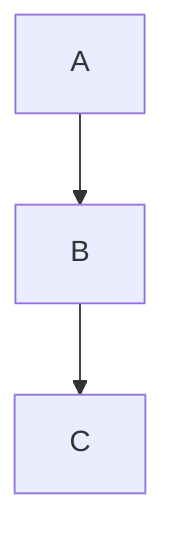

# Product Spec: GitHub-Flavored Markdown Preview

## Problem

CastCodes' markdown previewer (the **Rendered** mode in CodeView when opening a `.md` file) supports the core CommonMark surface plus GFM tables, task lists, autolinks, and strikethrough. Several GFM constructs that are common in real-world READMEs do not render today:

- Raw HTML in the body of the markdown file. `<details>`/`<summary>` collapsible sections, `<kbd>` key labels, `<sub>`/`<sup>`, raw `<table>`, `` with explicit dimensions, and inline phrasing tags like `<u>` or `<br>` all pass through as literal text.
- Footnotes (`[^1]` references with `[^1]: definition` blocks).

The result is that READMEs copied from GitHub-hosted projects render with visible angle-bracket noise and broken structure in CastCodes' preview. The branch name `cast/md-html-support` and the user request frame this work explicitly.

Mermaid (```mermaid fenced blocks) and autolinks are already wired through to the renderer; this work treats them as already-working and verifies them rather than reimplementing.

## Goals

- Raw HTML on GitHub's safe-list renders as the matching visual treatment in CodeView's `.md` Rendered preview.
- Footnotes resolve to a clickable in-document hyperlink and a footnotes section at the bottom of the rendered output.
- Mermaid blocks confirmed rendering in CodeView's `.md` preview (smoke test only; no expected code change).
- No regression to existing markdown rendering surfaces (notebooks, AI blocks, embedded items, conversation messages).

## Non-Goals (v1)

- Interactive `<details>` collapsing in the preview. v1 renders always-expanded.
- Full HTML rendering. Tags outside the safe-list pass through as literal text, matching GitHub's tag-filter behavior.
- New rendering surfaces. The notebook editor's HTML-paste path (`parse_html`) is reused as a library, not exposed as a new entry point.
- Editing-mode mermaid (the `editable_markdown_mermaid` feature flag stays off).
- A separate user preference, settings UI, or feature flag for this change.

## User-Visible Behavior

### Opening a markdown file with HTML

A `.md` file containing, for example:

```markdown
<details>
<summary>Click to see commands</summary>

- `cargo build`
- `cargo test`

</details>

Press <kbd>Cmd</kbd>+<kbd>K</kbd> to clear.

H<sub>2</sub>O and E = mc<sup>2</sup>.

This is <u>important</u>.
```

renders in the Rendered preview as:

- The `<details>` block shows the summary line "Click to see commands" prefixed by a ▾ disclosure glyph, with the bulleted commands expanded immediately below.
- `<kbd>Cmd</kbd>` and `<kbd>K</kbd>` render as inline-code-styled chips (the existing `inline_code` styling on the fragments).
- Subscript and superscript text render at the normal baseline with an italic style flag for visual distinction. The existing render model doesn't carry vertical-shift styling, and v1 stays out of that work.
- `<u>important</u>` renders with the underline style on the word "important".

### Footnotes

```markdown
Here is a claim.[^why]

[^why]: Because the spec says so.
```

renders as:

- "Here is a claim.¹" — the `[^why]` reference becomes a clickable superscript-styled hyperlink fragment carrying the label `1` (numbered in order of first reference, not by the id text).
- At the bottom of the document, after a horizontal rule, a numbered list: "1. Because the spec says so. ↩" where `↩` is a hyperlink back to the reference.
- Unresolved references (no matching definition) stay as literal `[^id]` text.

### Mermaid (verification only)

```markdown

```

renders as a centered SVG diagram in the Rendered preview, with a "Rendering Mermaid diagram…" placeholder while the SVG is being generated. This already works via the `markdown_mermaid` feature (on by default) and the `InteractionState::Selectable` trigger; the verification step in §Tests confirms no regression.

### Tag filtering

The following tags strip to their raw text content (matching GitHub):

- `<script>`, `<style>`, `<iframe>`, `<object>`, `<embed>`, `<form>`, `<input>` (except as already-supported task list checkboxes inside list items), `<button>`, `<link>`, `<meta>`.

Unknown tags pass through as literal text. There is no error surface — malformed HTML degrades gracefully into plain text.

## Success Criteria

A `.md` file containing all of the safe-list tags + footnotes + a mermaid block + the existing GFM features renders correctly in CodeView's Rendered preview with no leftover angle-bracket text, no panics, no visible regressions to existing markdown rendering elsewhere in the app (notebooks, AI blocks, conversation history, embedded items).
