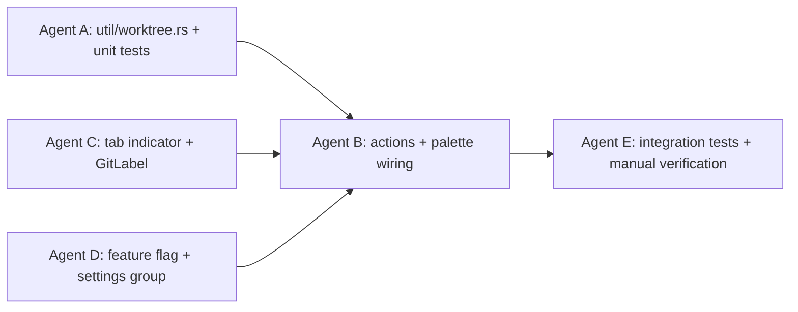

# Worktree Manager — Tech Spec

See `PRODUCT.md` for user-visible behavior. See `PRODUCT.md` § "MVP scope" for what actually ships in this PR vs. what's deferred.

## MVP integration notes (from implementation discovery)

CastCodes already has the following infrastructure we now integrate with rather than duplicate:

- **`WorkspaceAction::OpenNewWorktreeModal`** at `app/src/workspace/action.rs:687-689`, handler at `app/src/workspace/view.rs:21110-21123`. Existing user-facing create flow. Our "New worktree…" palette entry dispatches this rather than building a parallel create handler.
- **`WorkspaceAction::OpenWorktreeInRepo { repo_path: String }`** at `action.rs:692-695`, handler `Workspace::open_worktree_in_repo` at `view.rs:9503-9577`. Existing open-existing-worktree handler. Our "Open worktree in repo…" palette entry opens a bespoke `WorktreePicker` (copy of `BranchPicker` at `app/src/tab_configs/branch_picker.rs:28-111`) that fetches rows via `list_worktrees` and on-select dispatches `OpenWorktreeInRepo`.
- **Toast infra:** `DismissibleToast::error(msg)` + `view.toast_stack.update(ctx, |s, c| s.add_persistent_toast(t, c))`. Canonical example: `view.rs:7812-7838`.
- **Async spawn:** `ctx.spawn(async move { … }, move |view, result, ctx| { … })` on `ViewContext<Workspace>`. Canonical: `view.rs:7812` and `app/src/tab_configs/branch_picker.rs:138-145`.
- **Tab spawn with starting CWD:** `Workspace::add_tab_with_pane_layout(PanesLayout::SingleTerminal(Box::new(NewTerminalOptions { initial_directory: Some(cwd), …Default::default() })), …)`. Canonical: `view.rs:11057-11075` (`add_new_coven_session_tab`). Not directly used in MVP since we delegate to the existing `OpenWorktreeInRepo` handler, but documented for the deferred Remove flow.
- **Palette entry registration:** `EditableBinding::new("workspace:<key>", "<description>", WorkspaceAction::X).with_context_predicate(id!("Workspace")).with_group(bindings::BindingGroup::Settings.as_str())` registered in `app/src/workspace/mod.rs`. Canonical: `mod.rs:952-958` (`RenameActivePane`). Bindings that need runtime-state gating require a new context flag managed by Workspace — deferred for MVP; our handlers degrade gracefully via toast.
- **Repo root detection:** Add `pub fn detect_repo_root_sync(cwd: &Path) -> Option<PathBuf>` next to `detect_git_dirs_sync` at `app/src/util/git.rs:88` running `git rev-parse --show-toplevel`. The cached app-side alternative `crates/repo_metadata/src/repositories.rs:167` (`DetectedRepositories::get_root_for_path`) is preferred when a `ViewContext` is already in scope.

### Variant changes vs. original TECH.md

The original spec proposed four new `WorkspaceAction` variants. After discovery, the MVP shipping set is:

- ❌ `NewWorktreeFromBranch { branch, open_in }` — **dropped** (duplicates `OpenNewWorktreeModal`).
- ❌ `OpenWorktreeInTab { worktree_path }` — **dropped** (duplicates `OpenWorktreeInRepo`).
- ✅ `RemoveWorktree { worktree_path, force }` — **kept**; MVP handler toasts "Coming in a follow-up".
- ✅ `PruneWorktree { worktree_path }` — **kept**; same MVP handler.
- ➕ `OpenWorktreePicker` (no fields) — **added** as a sentinel that the "Open worktree in repo…" palette entry dispatches; handler opens the `WorktreePicker` modal.
- ➕ `OpenWorktreeRemoveStub` (no fields) — **added** as a sentinel that the "Remove worktree…" palette entry dispatches; handler emits the "coming soon" toast.

Supporting types `BranchTarget` and `WorktreeOpenTarget` are dropped along with the variants that used them.

## Context

CastCodes already has all the primitives this feature needs; the work is wiring four existing surfaces together behind a new feature flag, plus one new util module that wraps `git worktree`.

Relevant code:

- `app/src/util/git.rs` — canonical async git wrapper. Exports `run_git_command(repo, args)`, `detect_current_branch(repo)`, `detect_main_branch(repo)`, `get_all_branches(repo, max, include_remotes)`. Entire module is feature-gated `local_fs`; WASM build returns `Err(anyhow!("Not supported on wasm"))`. There is currently **no** `git worktree` wrapper.
- `crates/repo_metadata/src/entry.rs:321` — `is_git_internal_path(path)`; `crates/repo_metadata/src/entry.rs:390` — `extract_worktree_git_dir(path)` already recognizes the `.git/worktrees/<name>/HEAD` layout and returns `<repo>/.git/worktrees/<name>`. Tests in `crates/repo_metadata/src/entry_tests.rs:286-330` cover the worktree path shapes.
- `app/src/workspace/action.rs` — `WorkspaceAction` enum (around line 99+). Canonical example variant for a context-aware action is `RenamePane(PaneViewLocator)`.
- `app/src/workspace/global_actions.rs:71-93` — `init_global_actions(app: &mut AppContext)` showing the deprecated global pattern. New work follows the typed-action pattern (see `app/src/workspace/action_tests.rs:10-80`).
- `app/src/command_palette.rs` — `PRIORITIZED_KEYBINDINGS` list. `app/src/palette.rs` — `PaletteMode` enum (`Command`, `Files`, `Conversations`, etc.). Sub-pickers (Files, Conversations) are the right precedent for the branch/worktree pickers.
- `app/src/pane_group/mod.rs` — `PaneGroup` model; spawns new panes/tabs with a starting CWD. `app/src/pane_group/working_directories.rs:78-80` — `WorkingDirectory { path, terminal_id }` tracks per-pane CWD.
- `app/src/tab.rs:37` — `current_git_branch(&self, ctx)`. `app/src/tab.rs:600+` — tab title is composed from `pane_group.display_title(ctx)`. `app/src/workspace/view/vertical_tabs.rs` renders the same data in the vertical tab strip.
- `app/src/terminal/view/tab_metadata.rs:15-24` — `TerminalView::display_working_directory(ctx)`. `:36-50` — `TerminalView::current_git_branch(ctx)`. Branch is read from shell context chips (`ContextChipKind::ShellGitBranch`) with a filesystem fallback (`git_status_metadata`).
- `crates/warp_features/src/lib.rs` — `FeatureFlag` enum. Recent example: `FeatureFlag::VerticalTabs` (consumed in `app/src/tab.rs:63`).
- `crates/settings/src/lib.rs` + `crates/settings/src/macros.rs` — `define_settings_group!` macro; settings read via `Setting<T>: Deref<Target = T>` pattern (see `TabSettings::as_ref(ctx).use_vertical_tabs`).
- `crates/integration/src/test/pane_restoration.rs:26-67` — Builder pattern for end-to-end tests, with `FeatureFlag::X.set_enabled(true)` at the top.
- `cast_agent/src/substrate.rs` comment notes existing awareness of the `gitdir:` indirection used by worktrees — no behavioral change here, but tells us the agent path will not be confused by worktree-based working directories.

## Proposed changes

### 1. New module: `app/src/util/worktree.rs`

A thin async wrapper around `git worktree`, mirroring the shape of `util/git.rs` (same `local_fs` feature gate, same `run_git_command` plumbing for the shell-out).

```rust
pub struct WorktreeInfo {
    pub path: PathBuf,
    pub branch: Option<String>,   // None when detached
    pub head: String,             // short SHA
    pub is_main: bool,
    pub is_locked: bool,
    pub is_prunable: bool,
    pub is_bare: bool,
}

pub async fn list_worktrees(repo: &Path) -> Result<Vec<WorktreeInfo>>;
pub async fn add_worktree(repo: &Path, target: &Path, branch: &str, create: bool) -> Result<()>;
pub async fn remove_worktree(repo: &Path, target: &Path, force: bool) -> Result<()>;
pub async fn prune_worktrees(repo: &Path) -> Result<()>;

pub fn default_staging_dir(repo_root: &Path, slug: &str, override_tmpl: Option<&str>) -> PathBuf;
pub fn slugify_branch(branch: &str) -> String;
pub fn unique_path(base: &Path) -> PathBuf;  // appends -2, -3, … if base exists
```

Internals:
- `list_worktrees` parses `git worktree list --porcelain`. Porcelain format is stable across git ≥ 2.7. Parser is a small line-state machine; tested against fixture strings (see Testing below).
- `add_worktree` runs `git worktree add [-b <branch>] <target> <branch>`. The `-b` is added only when `create == true` (new branch path). Existing-branch path omits `-b`.
- `remove_worktree` runs `git worktree remove [--force] <target>`. Force is opt-in per (15).
- Slug rules match PRODUCT.md (6): lowercase the branch, replace any `[^a-z0-9._-]` with `-`, collapse runs of `-`, trim `-` from ends. Empty result falls back to `worktree`.
- `default_staging_dir` resolves `override_tmpl` placeholders `<repo-root>` and `<branch-slug>` (PRODUCT.md 22). When `override_tmpl` is None, returns `<repo-root>/.castcodes/worktrees/<slug>`.

Why a sibling module rather than extending `util/git.rs`: `git.rs` is already a large file and the worktree wrapper has its own porcelain parser worth isolating. Same public re-export style.

### 2. WorkspaceAction variants and handlers

Add to `WorkspaceAction` in `app/src/workspace/action.rs`:

```rust
NewWorktreeFromBranch { branch: BranchTarget, open_in: WorktreeOpenTarget },
OpenWorktreeInTab { worktree_path: PathBuf },
RemoveWorktree { worktree_path: PathBuf, force: bool },
PruneWorktree { worktree_path: PathBuf },
```

Supporting types:
```rust
pub enum BranchTarget { Existing(String), CreateFromHead(String) }
pub enum WorktreeOpenTarget { NewTab }  // single variant today; leaves room for NewSplit later
```

Handlers live next to other typed-action handlers (not in `global_actions.rs`; that file is deprecated per the comment at the top). Each handler:
- Resolves the active pane's repo root via `detect_repo_root` (already used in `util/git.rs`).
- Calls the matching `worktree::*` fn.
- On success, dispatches an existing tab-spawn action (the same one the "+" button uses) with the new CWD.
- On failure, dispatches an error toast (existing toast infra; see how `RenameTab` surfaces errors).

Gating: each handler is a no-op when `FeatureFlag::WorktreeManager` is off, so action serialization stays well-defined even if a session restore replays an action after the flag was disabled.

### 3. Palette wiring

Add 3 entries (the 4th, `PruneWorktree`, is reachable only from the "Open" sub-picker per PRODUCT.md 13) in Command mode. Entries are added in `app/src/command_palette.rs` next to existing static entries. Their visibility predicate is "feature flag on AND active pane has a CWD". The disabled-with-subtitle case in PRODUCT.md 3 is implemented via the existing palette-entry disabled state.

Branch sub-picker (PRODUCT.md 5):
- Backed by `get_all_branches(repo, max=200, include_remotes=true)`.
- "In use" tag derived from intersecting branch list with `list_worktrees`.
- "Create new branch" affordance is the existing "no match" entry treatment.

Worktree sub-picker (PRODUCT.md 11, 15):
- Backed by `list_worktrees(repo)`.
- Sort: main first, then by `path`. Status badges from `WorktreeInfo` flags.
- For the "Remove…" variant, the main worktree row is filtered out.

Confirmation modal for removal (PRODUCT.md 15) reuses the existing modal infra (the same one used for destructive Tab close confirmations).

### 4. Tab indicator extension

Extend `TerminalView::current_git_branch` → new sibling `current_git_label`:

```rust
pub fn current_git_label(&self, ctx: &AppContext) -> Option<GitLabel>;

pub struct GitLabel {
    pub worktree_slug: Option<String>,  // None ⇒ main worktree
    pub branch_or_sha: String,
    pub missing: bool,                  // PRODUCT.md 19
}
```

Resolution path:
1. Read CWD via existing `display_working_directory`.
2. Use `extract_worktree_git_dir` (already public in `repo_metadata`) to detect whether the CWD lives under a non-main worktree.
3. If yes: slug = last segment of the worktree's checkout path; branch = shell chip first, filesystem fallback second (existing logic in `current_git_branch`).
4. If the worktree path no longer exists on disk: set `missing = true`.

Render call sites change from `current_git_branch` to `current_git_label` and format the label per PRODUCT.md 16–19. Touchpoints: `app/src/tab.rs` (~line 600), `app/src/workspace/view/vertical_tabs.rs`, plus tooltip rendering that currently uses `TabData::tooltip_git_branch`.

Keep `current_git_branch` as a back-compat thin wrapper to avoid churning callers we don't need to touch.

### 5. Feature flag

Add `FeatureFlag::WorktreeManager` to `crates/warp_features/src/lib.rs` (Sequence is auto-derived). Default rollout: Dogfood. No compile-time `#[cfg(feature = "…")]` — runtime check only, consistent with `VerticalTabs`.

### 6. Settings

Declare a new settings group:

```rust
define_settings_group! {
    pub group WorktreeManagerSettings {
        pub staging_directory: Option<String> = None,   // path template
        pub prune_on_remove: bool = false,
    }
}
```

Lives next to the other small settings declarations (likely a new `app/src/settings/worktree_manager.rs`, registered from wherever sibling groups register). The `staging_directory` template is parsed at use time by `default_staging_dir`.

### 7. Cross-instance / cross-pane

No new IPC or state. The picker reads from disk on open (PRODUCT.md 14); two windows updating the same repo's worktree list converge on the next picker open. The tab indicator already updates per-pane on CWD change; no shared state needed.

### 8. WASM build

Everything in `util/worktree.rs` is gated `local_fs`. The action handlers and palette entries check `cfg(feature = "local_fs")` at the dispatch site, mirroring how other filesystem-touching actions degrade on WASM (PRODUCT.md 29).

## Testing and validation

Each PRODUCT.md invariant maps to a concrete check.

**Unit tests (`app/src/util/worktree_tests.rs`):**
- `slugify_branch`: covers PRODUCT.md (6) — `feature/foo` → `feature-foo`, whitespace, dots, emoji, leading/trailing `-`, empty-result fallback.
- `default_staging_dir`: PRODUCT.md (22, 23) — default template, override with `<repo-root>`/`<branch-slug>` placeholders, absolute override, relative override.
- `unique_path`: PRODUCT.md (6) — collision suffixing.
- `parse_worktree_list_porcelain`: fixtures for main only, main + 1 worktree, locked, prunable, detached HEAD, bare. Covers PRODUCT.md (11) status tags.

**Action-property unit tests (extending `app/src/workspace/action_tests.rs`):**
- `NewWorktreeFromBranch::should_save_app_state_on_action() == true`.
- `RemoveWorktree::should_save_app_state_on_action() == true`.
- All variants serialize/deserialize round-trip.

**Tab-indicator unit tests:**
- `current_git_label` with synthetic `TerminalView` whose `display_working_directory` returns paths under main worktree, under a non-main worktree, detached HEAD, and a deleted worktree. Covers PRODUCT.md (16)–(21).

**Integration tests (`crates/integration/src/test/worktree_manager.rs`):**

Builder-style following `pane_restoration.rs:26-67`. Each test enables the flag at the top: `FeatureFlag::WorktreeManager.set_enabled(true)`.

- `test_new_worktree_from_branch` — bootstrap a repo with branch `feature/a`, open palette, pick **New worktree from branch…**, pick `feature/a`. Assert: tab count +1, new tab's CWD is `<repo>/.castcodes/worktrees/feature-a`, tab label contains `feature-a · feature/a`. Covers PRODUCT.md (5–8, 17).
- `test_new_worktree_slug_collision` — pre-create `.castcodes/worktrees/feature-a`, run flow, assert new dir is `feature-a-2`. Covers PRODUCT.md (6).
- `test_open_worktree_lists_existing` — after the create test, open **Open worktree in new tab…**, assert main and `feature-a` listed. Pick `feature-a`, assert tab opens at correct CWD. Covers PRODUCT.md (11, 12).
- `test_remove_worktree_keeps_pane` — create `feature-a`, open it in a tab, then **Remove worktree…** for it. Assert tab still exists, indicator shows missing treatment, directory gone from `list_worktrees`. Covers PRODUCT.md (15, 19).
- `test_palette_disabled_outside_repo` — open palette in a pane whose CWD is `/tmp`, assert all three entries visible but unselectable. Covers PRODUCT.md (3).
- `test_flag_off_hides_entries` — flag off, palette has no worktree entries. Covers PRODUCT.md (1).
- `test_setting_overrides_staging_dir` — set `worktree_manager.staging_directory = "/tmp/wt/<branch-slug>"`, run create flow, assert dir created at `/tmp/wt/feature-a`. Covers PRODUCT.md (22).
- `test_create_new_branch_path` — pick **New worktree from branch…**, type a branch name not in the list, confirm. Assert branch created from current HEAD and worktree opened. Covers PRODUCT.md (5 bullet 3, 6 bullet 3).
- `test_remove_force_path` — make worktree dirty (write a file), attempt remove, assert non-force fails with stderr toast, then confirm with **Force remove**, assert success. Covers PRODUCT.md (15 bullet 1, 10).

**Manual verification:**
- WASM build: open the web preview, confirm palette entries absent and tab indicator falls back to branch-only. Covers PRODUCT.md (29).
- Indicator live-update: in one pane, `cd` between main and a worktree, watch the indicator change without refocus. Covers PRODUCT.md (20).
- Two panes, same worktree: visual check that both indicators update on remove. Covers PRODUCT.md (26, 19).
- Two panes, two worktrees of one repo: visual check that switching focus does not change either pane's CWD. Covers PRODUCT.md (27).

**Out-of-scope checks (explicit non-regressions):**
- Existing branch-only tab indicator on a normal checkout is unchanged when feature flag is on (snapshot or pixel diff on an existing tab fixture).
- `cast_agent` paths that read `gitdir:` files are unchanged (run existing agent tests).

## Parallelization

Worth doing — three sub-agents can land Phase 1 in parallel without colliding, cutting wall-clock by roughly a third on a feature of this size. Phase 2 funnels through one agent because palette + handlers + dispatch all touch the same files. Phase 3 is serial because integration tests exercise everything together.



**Agent A — `util/worktree.rs`**
- Execution: `local`. Pure Rust, no UI scaffolding, fast feedback via `cargo test -p app`.
- Worktree: `~/.codex/worktrees/wt-mgr-util/cast-codes` off branch `feat/worktree-manager-util`.
- Owns: `app/src/util/worktree.rs`, `app/src/util/worktree_tests.rs`, fixture files under `app/src/util/worktree_test_fixtures/`. Does **not** touch `util/git.rs` (uses its public `run_git_command`).
- Sync: when done, opens a PR into `feat/worktree-manager` (the integration branch this spec lives on) and notifies B.

**Agent C — tab indicator**
- Execution: `local`. Touches view code; needs the app to compile but not run.
- Worktree: `~/.codex/worktrees/wt-mgr-tab/cast-codes` off `feat/worktree-manager-tab`.
- Owns: extensions to `app/src/terminal/view/tab_metadata.rs`, `app/src/tab.rs` (label-call-site only), `app/src/workspace/view/vertical_tabs.rs` (label-call-site only). Does **not** define `WorktreeInfo` (depends on Agent A's `repo_metadata::extract_worktree_git_dir`, which already exists, so Agent C is not blocked).
- Sync: PR into `feat/worktree-manager`; merges before B starts wiring handlers that depend on the new `GitLabel`.

**Agent D — feature flag + settings**
- Execution: `local`. One-file changes in two crates.
- Worktree: `~/.codex/worktrees/wt-mgr-flag/cast-codes` off `feat/worktree-manager-flag`.
- Owns: `crates/warp_features/src/lib.rs` (`WorktreeManager` variant), new `app/src/settings/worktree_manager.rs` + its registration.
- Sync: PR into `feat/worktree-manager`.

**Agent B — actions + palette (sequential after A, C, D)**
- Execution: `local`.
- Worktree: `~/.codex/worktrees/wt-mgr-ui/cast-codes` off `feat/worktree-manager-ui`, branched from `feat/worktree-manager` **after** A, C, D have merged into it.
- Owns: `WorkspaceAction` variants and handlers (new files under `app/src/workspace/actions/worktree_manager/`), `app/src/command_palette.rs` entry additions, the branch/worktree sub-pickers.
- Sync: PR into `feat/worktree-manager`. This is the largest agent and benefits from the prior three having merged so its diff doesn't conflict.

**Agent E — integration tests (sequential after B)**
- Execution: `local`. Needs the whole feature on one branch.
- Worktree: `~/.codex/worktrees/wt-mgr-test/cast-codes` off `feat/worktree-manager-tests`.
- Owns: `crates/integration/src/test/worktree_manager.rs`, wiring into the manual runner, fixture repos.
- Sync: PR into `feat/worktree-manager`. Final PR before `feat/worktree-manager` itself is opened against `main`.

**PR strategy.** Sub-agent PRs land into `feat/worktree-manager` (the integration branch this spec is committed on). When all five have merged in, that branch is opened as a single PR against `main`. Reviewers get one cohesive change to review, while the sub-PR history preserves the parallel work.

**No coordination overhead beyond the merge points above.** Files are partitioned cleanly per agent; nobody edits the same file as another sibling agent. All five agents must rebase their working branch onto the latest `feat/worktree-manager` before opening their sub-PR.

## Risks and mitigations

- **`git worktree list --porcelain` parser drift across git versions.** Porcelain v1 has been stable since git 2.7 (2016). Parser is defensive about unknown lines (ignored) and tested against captured fixtures from a current git. Risk: low. Mitigation: parser logs (debug-level) any unknown leading tokens so we can spot drift in telemetry without breaking.
- **User has worktrees outside `.castcodes/worktrees/`.** Already handled — picker uses `git worktree list`, slug for the indicator comes from the actual directory name, not from our staging convention.
- **Pane CWD inside a removed worktree.** PRODUCT.md (19) is explicit; tab indicator uses the `missing` flag and is non-fatal. No risk of crashing the pane.
- **`.castcodes/worktrees/` accidentally committed.** Feature does **not** auto-edit `.gitignore` (PRODUCT.md 28). Risk lives with the user. Mitigation: PR description for the feature points this out and recommends the `.gitignore` snippet.
- **Concurrent palette-driven `git worktree add` from two windows.** `git worktree` is process-safe (uses lockfiles internally). Worst case is one of the two fails with a clear error toast.

## Follow-ups

- Agent auto-isolation (PRODUCT.md 30) layers on top of the `WorkspaceAction::NewWorktreeFromBranch` handler and the `worktree::add_worktree` util — no rework needed when that ships.
- Session-restore worktree binding (PRODUCT.md 31) would extend the session model to remember `worktree_path` per pane. Out of scope here; the indicator already infers the worktree from CWD on every restore.
- "Switch pane to worktree" in-place was considered and rejected (presented in design but dropped) because injecting `cd` into a running shell is brittle. Revisit only if a clean shell-aware reattach mechanism lands.
